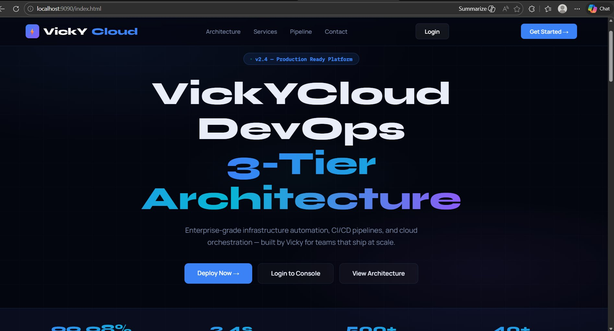
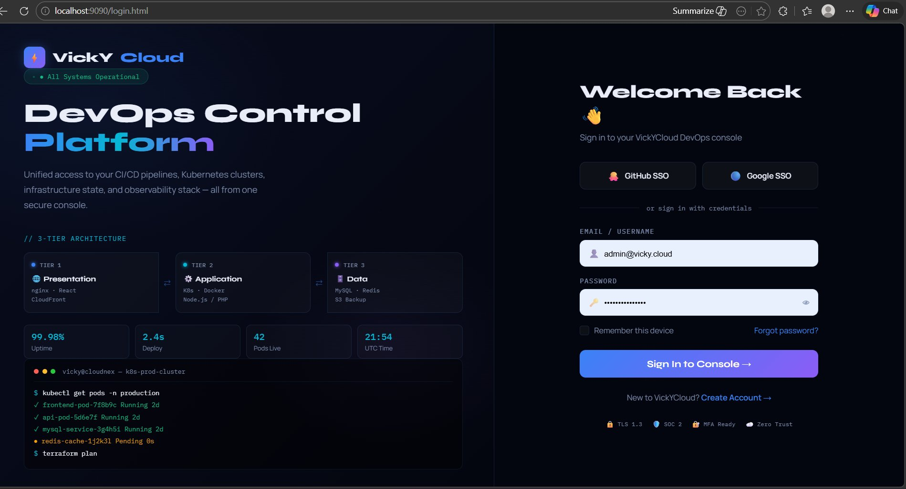
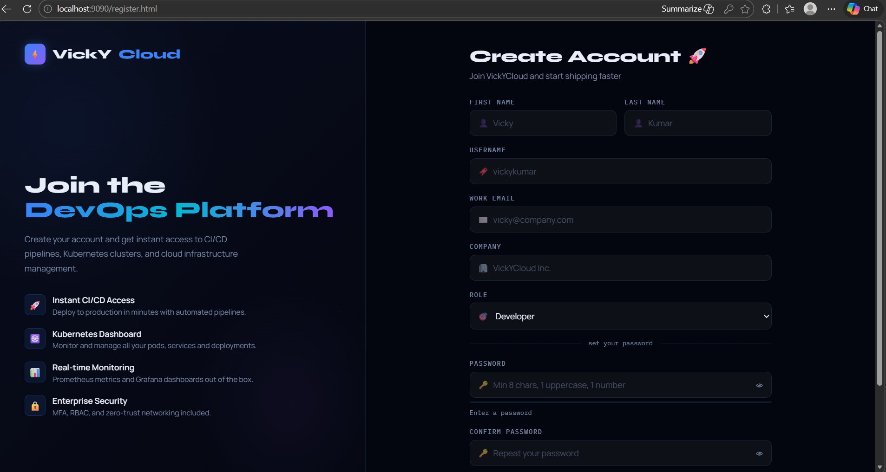
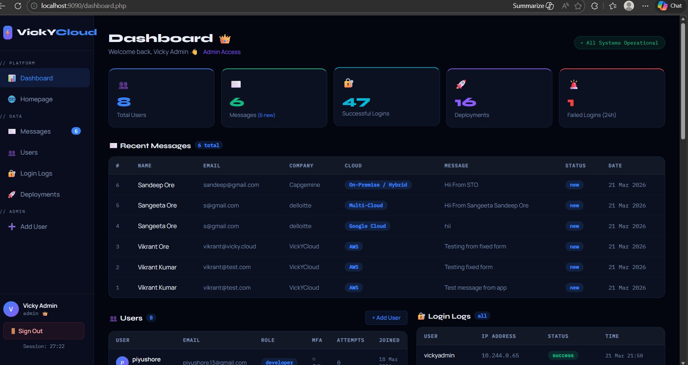
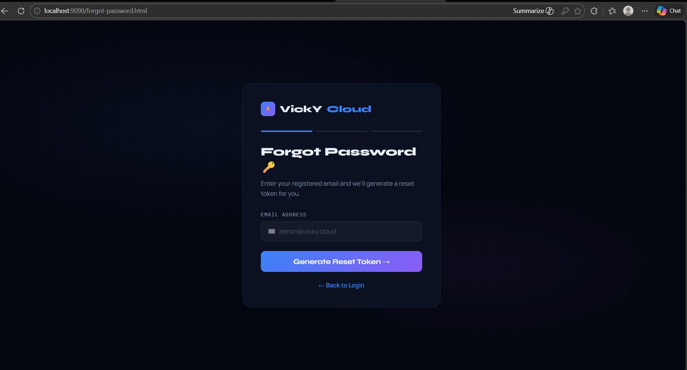
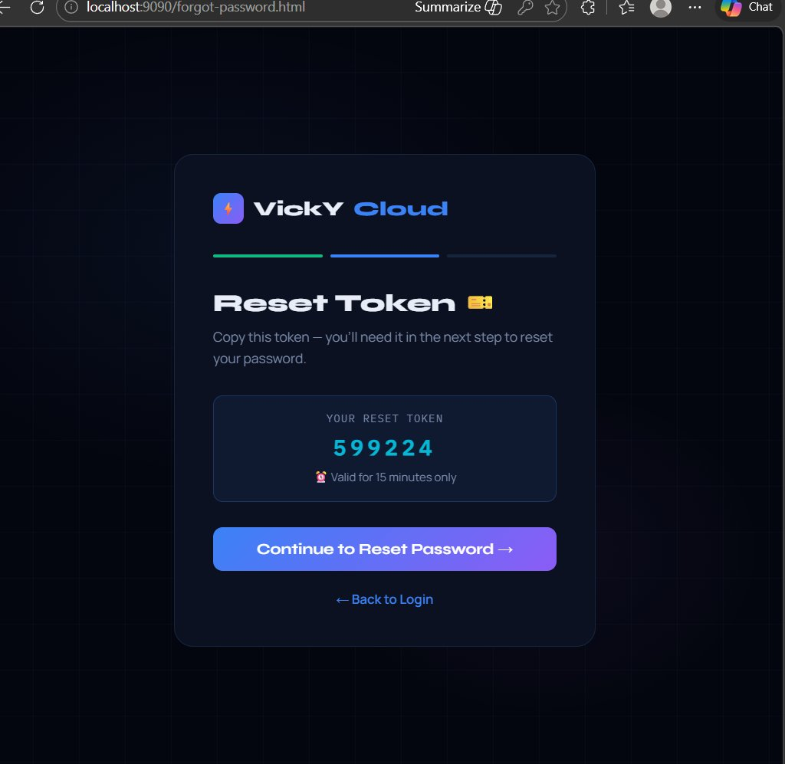
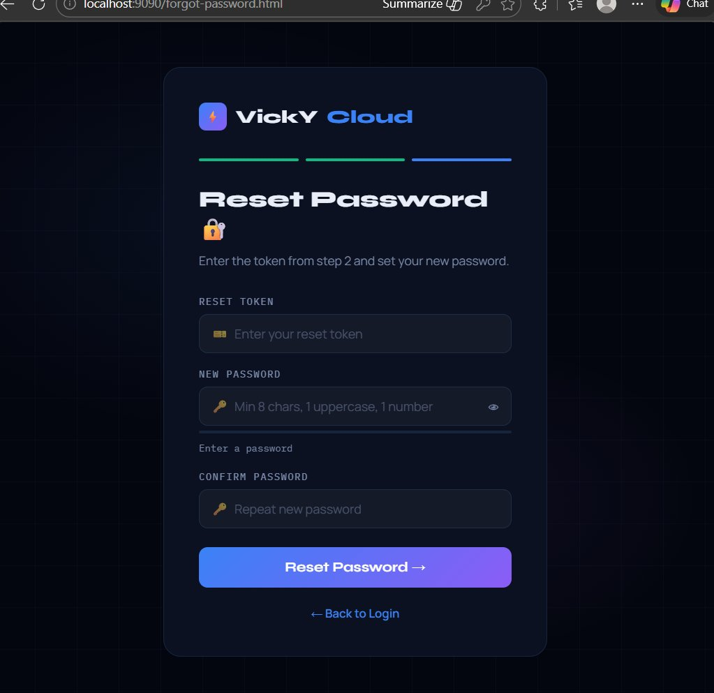
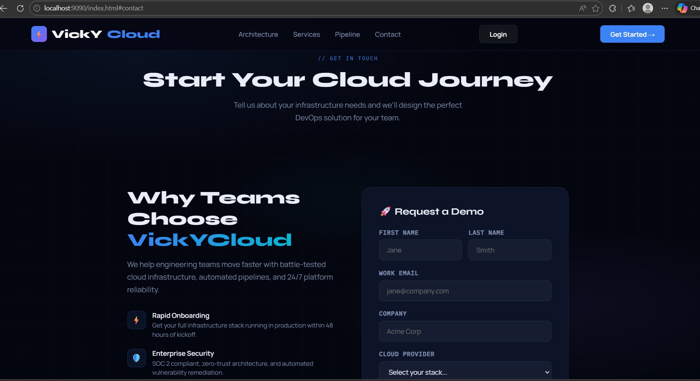

# ⚡ VickYCloud — DevOps 3-Tier Architecture Platform


> **Enterprise-grade DevOps platform** built from scratch — featuring a fully containerized 3-tier web application deployed on Kubernetes, automated CI/CD with GitHub Actions, Infrastructure as Code with Terraform, and real-time monitoring with Prometheus + Grafana.

---

## 📸 Screenshots

### 🏠 Landing Page


### 🔐 Login Page


### 📝 Register Page


### 📊 Admin Dashboard


### 🔑 Forgot Password




### 📬 Contact Form


---

## 🏗️ Architecture

```
┌─────────────────────────────────────────────────────────────┐
│                    Browser / User                           │
└──────────────────────────┬──────────────────────────────────┘
                           │ HTTP
┌──────────────────────────▼──────────────────────────────────┐
│                     WEB TIER                                │
│              nginx:alpine  |  NodePort :30080               │
│  index.html · login.html · register.html · forgot-password  │
└──────────────────────────┬──────────────────────────────────┘
                           │ proxy_pass
┌──────────────────────────▼──────────────────────────────────┐
│                     APP TIER                                │
│             php:8.2-apache  |  ClusterIP :80                │
│  login.php · register.php · submit.php · dashboard.php      │
│  logout.php · forgot-password.php                          │
└──────────────────────────┬──────────────────────────────────┘
                           │ mysqli
┌──────────────────────────▼──────────────────────────────────┐
│                      DB TIER                                │
│              MySQL 8.0  |  ClusterIP :3306  |  PVC 5Gi      │
│  users · messages · login_logs · deployments · reset_tokens │
└─────────────────────────────────────────────────────────────┘
```

### CI/CD Pipeline

```
git push → Lint (hadolint) → Build & Push (Docker Hub) → Deploy (kubectl) → Smoke Tests → ✅ Live
```

---

## 🚀 Tech Stack

| Layer | Technology |
|---|---|
| **Web Tier** | nginx:alpine, HTML5, CSS3, JavaScript |
| **App Tier** | PHP 8.2, Apache, bcrypt, Sessions |
| **DB Tier** | MySQL 8.0, PersistentVolumeClaim |
| **Orchestration** | Kubernetes (Minikube), kubectl |
| **IaC** | Terraform (3 modules: namespace, configmap, k8s) |
| **CI/CD** | GitHub Actions (5 jobs) |
| **Monitoring** | Prometheus, Grafana, cAdvisor, kube-state-metrics, MySQL Exporter |
| **Containerization** | Docker, Docker Hub |

---

## 📁 Project Structure

```
vickycloud/
├── web-tier/
│   ├── Dockerfile
│   ├── default.conf          ← nginx reverse proxy config
│   ├── index.html            ← landing page + contact form
│   ├── login.html            ← secure login
│   ├── register.html         ← user registration
│   └── forgot-password.html  ← 3-step password reset
│
├── app-tier/
│   ├── Dockerfile
│   ├── submit.php            ← contact form handler
│   ├── login.php             ← bcrypt auth + lockout
│   ├── register.php          ← user registration
│   ├── dashboard.php         ← admin dashboard (role-based)
│   ├── logout.php            ← session destroy
│   └── forgot-password.php   ← token-based password reset
│
├── db-tier/
│   └── schema.sql            ← 5 tables with indexes
│
├── k8s/
│   ├── web-deployment.yml + web-service.yml
│   ├── app-deployment.yml + app-service.yml
│   └── db-deployment.yml + db-service.yml
│
├── terraform/
│   ├── main.tf
│   ├── variables.tf
│   ├── terraform.tfvars
│   └── modules/
│       ├── namespace/
│       ├── configmap/
│       └── k8s/
│
├── monitoring/
│   ├── prometheus/
│   │   ├── prometheus-config.yml
│   │   └── prometheus-deployment.yml
│   └── grafana/
│       └── grafana-deployment.yml
│
├── .github/workflows/
│   └── deploy.yml            ← CI/CD pipeline (5 jobs)
│
└── deploy-local.sh           ← local deploy script
```

---

## 🔧 Features

### Authentication System
- ✅ Secure login with bcrypt password hashing (cost=12)
- ✅ Account lockout after 5 failed attempts (15-minute lock)
- ✅ Session management with 30-minute timeout
- ✅ Remember-me cookie (SHA-256 hashed, 30 days)
- ✅ Token-based forgot password (6-digit, 15-minute expiry)
- ✅ Role-based access control (admin vs developer)

### Admin Dashboard
- ✅ Real-time stats (users, messages, logins, deployments)
- ✅ Failed login alerts (>5 in 24h)
- ✅ Users table (admin-only with login attempts tracking)
- ✅ Login logs (admin sees all, developer sees own only)
- ✅ Messages from contact form
- ✅ Deployment history (auto-logged by CI/CD)
- ✅ Session countdown timer

### Contact Form
- ✅ Real fetch POST to submit.php
- ✅ Data saved to MySQL messages table
- ✅ Rate limiting (5 submissions / 10 minutes)
- ✅ Prepared statements (SQL injection protection)

### Monitoring
- ✅ Running pods count
- ✅ CPU usage over time (per pod)
- ✅ Memory usage over time (per pod)
- ✅ MySQL UP status
- ✅ MySQL queries per second
- ✅ MySQL connections (active vs max)
- ✅ Pod status table
- ✅ Alerts: PodDown, MySQLDown

---

## 🛠️ Local Setup

### Prerequisites

```bash
# Install required tools
minikube    # v1.38+
kubectl     # v1.30+
docker      # v24+
terraform   # v1.6+
```

### Quick Start

```bash
# 1. Clone repository
git clone https://github.com/VickyCloud17/VickYCloud-3-tier-app.git
cd VickYCloud-3-tier-app

# 2. Start Minikube
minikube start --driver=docker --cpus=2 --memory=2700

# 3. Enable addons
minikube addons enable metrics-server
minikube addons enable storage-provisioner

# 4. Point Docker to Minikube daemon
eval $(minikube docker-env)

# 5. Build images
docker build -t vickycloud/web-tier:latest ./web-tier/
docker build -t vickycloud/app-tier:latest ./app-tier/

# 6. Deploy with Terraform
cd terraform/
terraform init
terraform apply \
  -var="mysql_password=password123" \
  -var="mysql_user=vickyuser" \
  -var="grafana_password=Admin@Grafana1" \
  -auto-approve

# 7. Start port-forward
kubectl port-forward svc/web-service 9090:80 -n vickycloud &

# 8. Open in browser
# http://localhost:9090
```

### Deploy Monitoring

```bash
kubectl apply -f monitoring/prometheus/prometheus-config.yml
kubectl apply -f monitoring/prometheus/prometheus-deployment.yml
kubectl apply -f monitoring/grafana/grafana-deployment.yml

# Port-forwards
kubectl port-forward svc/prometheus-service 9091:9090 -n monitoring &
kubectl port-forward svc/grafana-service 3000:3000 -n monitoring &
```

---

## 🌐 Access URLs

| Service | URL | Credentials |
|---|---|---|
| App | http://localhost:9090 | — |
| Login | http://localhost:9090/login.html | admin@vicky.cloud / VickyAdmin@2026 |
| Dashboard | http://localhost:9090/dashboard.php | (after login) |
| Prometheus | http://localhost:9091 | — |
| Grafana | http://localhost:3000 | admin / Admin@Grafana1 |

---

## 🔄 CI/CD Pipeline

The GitHub Actions pipeline runs on every `git push` to `main`:

| Job | Runner | Description |
|---|---|---|
| 🔍 Lint & Validate | ubuntu-latest | hadolint, kubeval, terraform validate |
| 🐳 Build & Push | ubuntu-latest | Builds Docker images, pushes to Docker Hub |
| 🚀 Deploy | self-hosted | kubectl set image, rolling update |
| ✅ Smoke Test | self-hosted | Tests all endpoints + MySQL health |

### GitHub Secrets Required

```
DOCKER_USERNAME    ← Docker Hub username
DOCKER_PASSWORD    ← Docker Hub access token
MYSQL_PASSWORD     ← password123
GRAFANA_PASSWORD   ← Admin@Grafana1
```

---

## 📊 Database Schema

```sql
users          → id, username, email, password_hash, role, mfa_enabled, login_attempts
messages       → id, first_name, last_name, email, company, cloud, message, status
login_logs     → id, user_id, ip_address, user_agent, status
deployments    → id, service_name, version, environment, status, deployed_by
reset_tokens   → id, user_id, token, expires_at, used
```

---

## 🔁 Local Deploy Script

```bash
# Deploy web tier only (HTML changes)
./deploy-local.sh web

# Deploy app tier only (PHP changes)
./deploy-local.sh app

# Deploy both tiers
./deploy-local.sh both
```

---

## 📈 Monitoring Stack

| Component | Purpose |
|---|---|
| Prometheus | Metrics collection (15s scrape interval) |
| Grafana | Visualization dashboard |
| cAdvisor | Container CPU/Memory metrics |
| kube-state-metrics | Pod/Deployment state metrics |
| MySQL Exporter | Database performance metrics |

---

## 👨‍💻 Author

**Vikrant Ore** — Built as a complete DevOps learning project covering:
- 3-tier web application architecture
- Kubernetes deployment and management
- Infrastructure as Code with Terraform
- CI/CD automation with GitHub Actions
- Production monitoring with Prometheus + Grafana
- Secure authentication with PHP

---

## 📄 License

MIT License — feel free to use this as a learning reference.

---

<div align="center">
  <strong>⚡ Built with VickYCloud — Enterprise DevOps Platform</strong><br/>
  <em>From zero to production-grade Kubernetes deployment</em>
</div>
